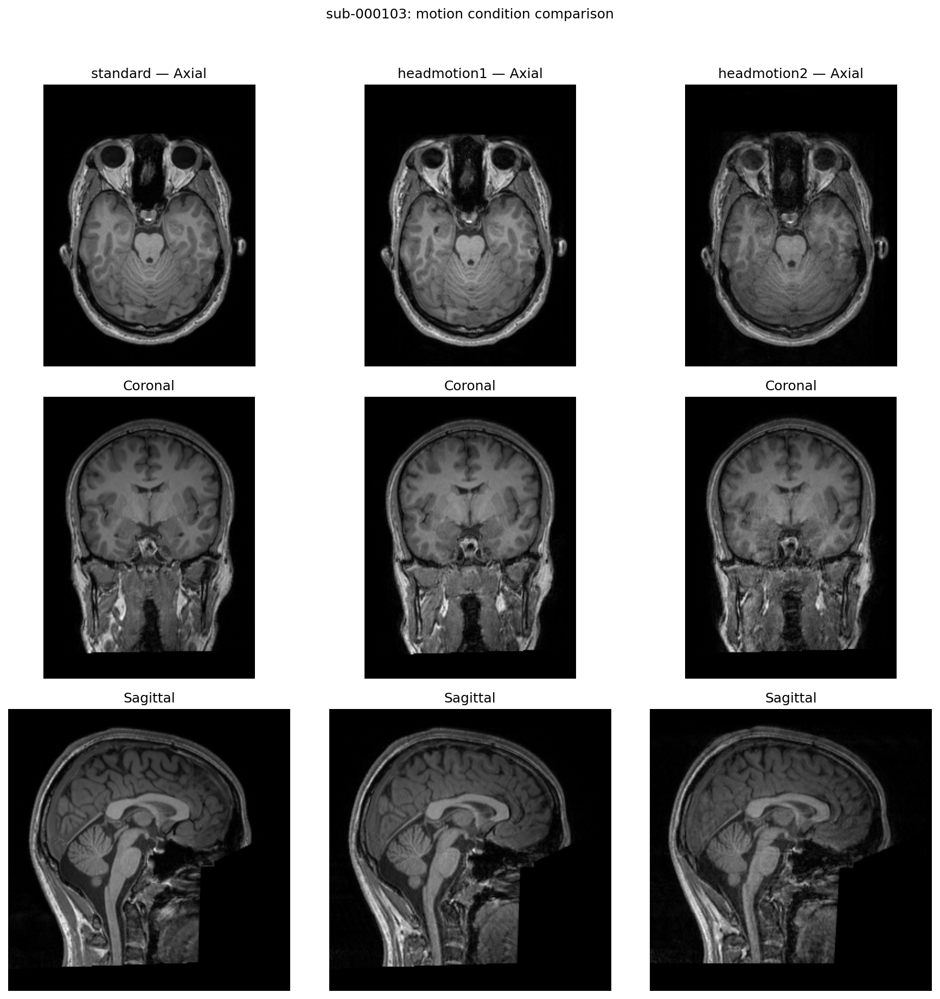
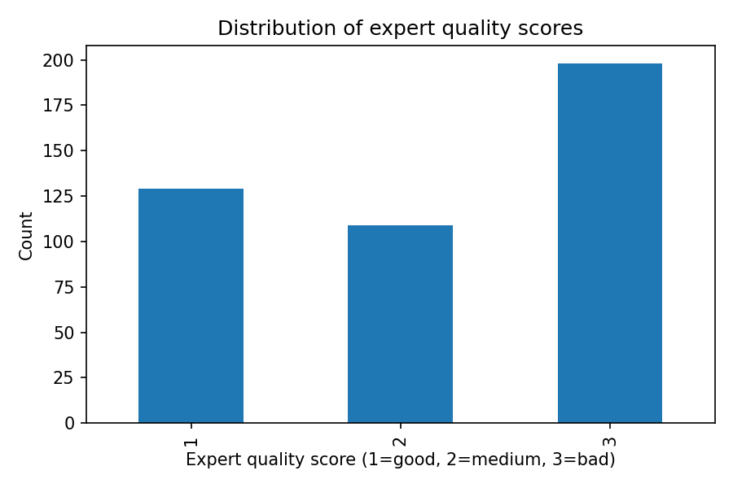
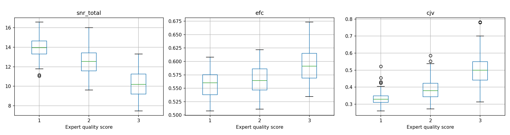
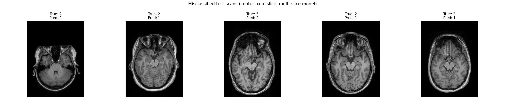
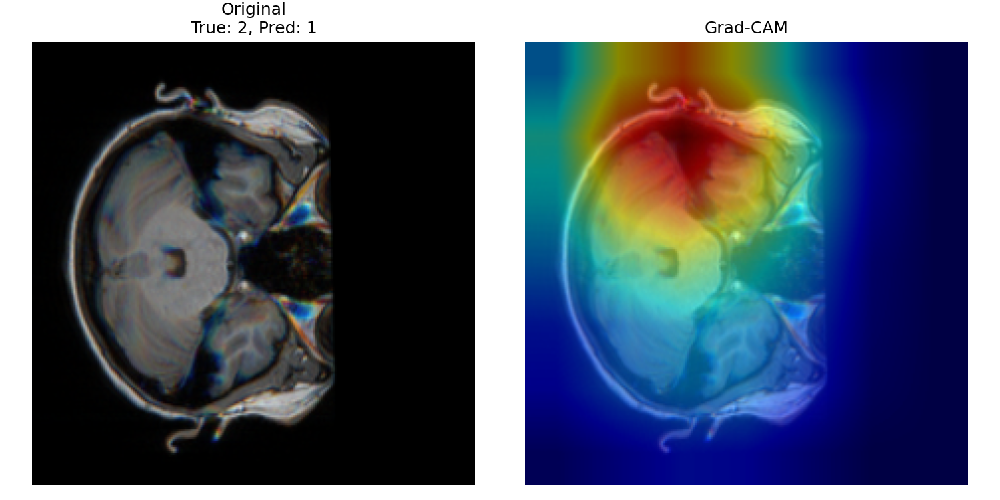

# MRI Quality Assessment — MR-ART Dataset

Technical task for Dr. İlkay Öksüz's PIMI Lab application. Predicts expert-rated MRI quality (1=good, 2=medium, 3=bad) from the [MR-ART dataset](https://openneuro.org/datasets/ds004173/versions/1.0.2), comparing classical ML (on MRIQC metrics) vs. deep learning (ResNet-18 on slices).

## Approach
1. EDA on motion artifacts and quality score distributions
2. Classical ML: Logistic Regression, Random Forest, XGBoost (on MRIQC features)
3. Deep learning: ResNet-18, 2.5D input, multi-slice training + test-time averaging
4. Bonus: attention-pooling ResNet-18 variant (inspired by Bakhale & Sao)
5. Evaluation: balanced accuracy, macro-F1, AUROC, confusion matrices, Grad-CAM

All splits are subject-level (no data leakage), fixed seed (42).

## EDA

**Motion artifact comparison (standard vs. headmotion1 vs. headmotion2):**

**Expert quality score distribution:**

**MRIQC metrics (SNR, EFC, CJV) by quality class:**

## Results (test set)

| Model | Balanced Acc | Macro F1 | AUROC |
|---|---|---|---|
| Logistic Regression | 0.672 | 0.670 | 0.819 |
| ResNet-18 (single-slice) | 0.685 | 0.679 | — |
| Attention ResNet-18 | 0.665 | 0.639 | — |
| XGBoost | 0.739 | 0.740 | 0.922 |
| ResNet-18 (multi-slice) | 0.731 | 0.718 | 0.915 |
| **Random Forest** | **0.781** | **0.782** | **0.921** |

**Random Forest — per-class breakdown (test set), best model overall:**

| Class | Precision | Recall | F1 | Support |
|---|---|---|---|---|
| 1 (good) | 0.86 | 0.90 | 0.88 | 21 |
| 2 (medium) | 0.62 | 0.53 | 0.57 | 15 |
| 3 (bad) | 0.88 | 0.91 | 0.89 | 32 |

**Confusion matrix (rows = true, cols = predicted):**

| | Pred 1 | Pred 2 | Pred 3 |
|---|---|---|---|
| **True 1** | 19 | 2 | 0 |
| **True 2** | 3 | 8 | 4 |
| **True 3** | 0 | 3 | 29 |

## Error analysis

**Misclassified test scans (multi-slice ResNet-18):**

**Grad-CAM — where the model looks when predicting quality:**

Every model's biggest weakness is the "medium" quality class — it sits ambiguously between good and bad, and gets confused with both. Error review shows the deep learning model tends to call medium-quality (mild motion) scans "good." Grad-CAM shows the model attends heavily to central brain structure rather than peripheral cortical edges, where motion blur is actually most visible — a plausible explanation for that confusion. With only ~300 training scans, tree-based models on MRIQC's hand-engineered features outperformed deep learning on raw pixels, likely because those features already encode domain expertise a CNN would otherwise need far more data to learn.

## Contents
- `PIMI_Task_MR_Quality_Classification.ipynb` — full notebook
- `subject_split.csv` — train/val/test split
- `*.png` — figures
- `requirements.txt` — package versions
- `AI_USAGE.md` — AI assistance disclosure

## Setup
Run in Google Colab with GPU. Dataset downloads automatically from OpenNeuro's public S3 bucket.

---

# MRI Kalite Değerlendirmesi — MR-ART Veri Seti

Dr. İlkay Öksüz'ün PIMI Lab başvurusu için teknik görev. [MR-ART veri setini](https://openneuro.org/datasets/ds004173/versions/1.0.2) kullanarak uzman kalite skorunu (1=iyi, 2=orta, 3=kötü) tahmin ediyor; klasik makine öğrenmesi (MRIQC ölçümleri) ile derin öğrenmeyi (kesitler üzerinde ResNet-18) karşılaştırıyor.

## Yöntem
1. Hareket artefaktları ve skor dağılımı üzerine keşifsel analiz
2. Klasik ML: Logistic Regression, Random Forest, XGBoost (MRIQC özellikleri üzerinde)
3. Derin öğrenme: ResNet-18, 2.5B giriş, çoklu kesit eğitimi + test aşamasında ortalama alma
4. Ek deneme: dikkat (attention) katmanlı ResNet-18 varyantı (Bakhale & Sao'dan esinlenilmiştir)
5. Değerlendirme: balanced accuracy, macro-F1, AUROC, confusion matrix, Grad-CAM

Tüm veri bölünmeleri katılımcı bazında (veri sızıntısı yok), sabit random seed (42).

## Keşifsel Analiz

**Hareket artefaktı karşılaştırması (standard vs. headmotion1 vs. headmotion2):**

**Uzman kalite skoru dağılımı:**

**Kalite sınıfına göre MRIQC ölçümleri (SNR, EFC, CJV):**

## Sonuçlar (test seti)

Yukarıdaki tabloyla aynı.

**Random Forest — sınıf bazında sonuçlar (test seti), en iyi model:**

Yukarıdaki tabloyla aynı.

**Confusion matrix:**

Yukarıdaki tabloyla aynı.

## Hata analizi

**Yanlış sınıflandırılan test taramaları:**

**Grad-CAM — model tahmin yaparken nereye bakıyor:**

Her modelin en zayıf noktası "orta" kalite sınıfı — hem iyi hem kötü ile karışıyor. Hata incelemesi, derin öğrenme modelinin orta kaliteli (hafif hareketli) taramaları "iyi" olarak etiketleme eğiliminde olduğunu gösteriyor. Grad-CAM, modelin hareket bulanıklığının asıl göründüğü çevresel kortikal kenarlar yerine beynin merkezi yapısına odaklandığını gösteriyor — bu da orta/iyi karışıklığını açıklayabilir. Sadece ~300 eğitim taraması ile, MRIQC'nin elle tasarlanmış özellikleri üzerindeki ağaç tabanlı modeller, ham pikseller üzerindeki derin öğrenmeyi geride bıraktı; muhtemelen bu özellikler bir CNN'in çok daha fazla veriyle öğrenmesi gereken uzmanlık bilgisini zaten içeriyor.

## İçerik
- `PIMI_Task_MR_Quality_Classification.ipynb` — tam analiz defteri
- `subject_split.csv` — eğitim/doğrulama/test ayrımı
- `*.png` — görseller
- `requirements.txt` — paket sürümleri
- `AI_USAGE.md` — yapay zekâ kullanımı açıklaması

## Kurulum
Google Colab'da GPU ile çalıştırın. Veri seti OpenNeuro'nun herkese açık S3 bucket'ından otomatik olarak indirilir.
