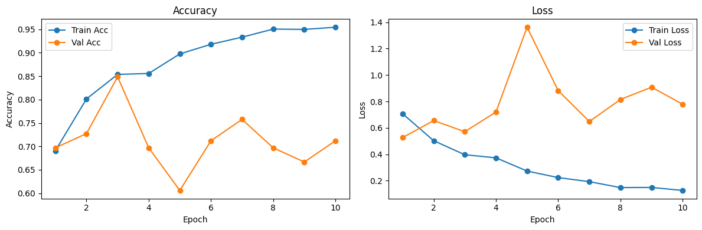
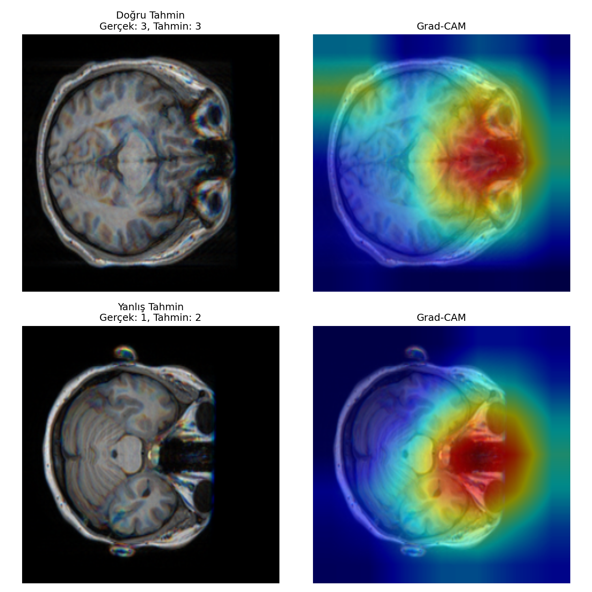
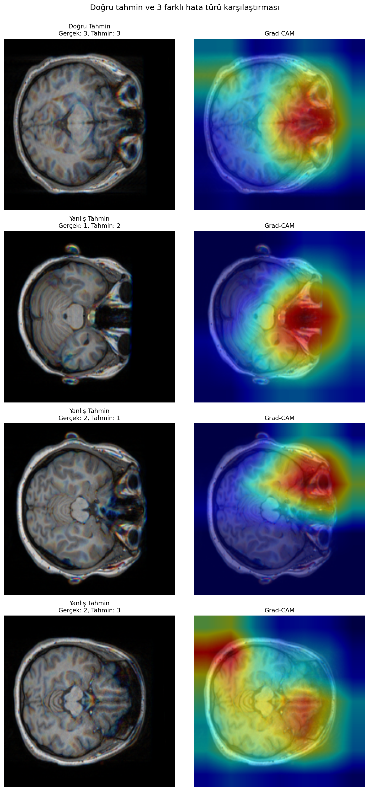
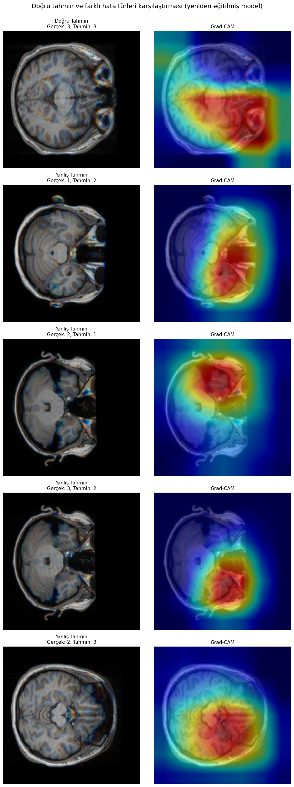

# MRI Quality Assessment — MR-ART Dataset

Technical task for Dr. İlkay Öksüz's PIMI Lab application. Predicts expert-rated MRI quality (1=good, 2=medium, 3=bad) from the [MR-ART dataset](https://openneuro.org/datasets/ds004173/versions/1.0.2), comparing classical ML (on MRIQC metrics) vs. deep learning (ResNet-18 on slices).

## Approach
1. EDA on motion artifacts and quality score distributions
2. Classical ML: Logistic Regression, Random Forest, XGBoost (on MRIQC features)
3. Deep learning: ResNet-18, 2.5D input, multi-slice training + test-time averaging
4. Bonus: attention-pooling ResNet-18 variant (inspired by Bakhale & Sao)
5. Evaluation: balanced accuracy, macro-F1, AUROC, confusion matrices, Grad-CAM

All splits are subject-level (no data leakage), fixed seed (42).

## EDA

**Motion artifact comparison (standard vs. headmotion1 vs. headmotion2):**

**Expert quality score distribution:**

**MRIQC metrics (SNR, EFC, CJV) by quality class:**

## Results (test set)

| Model | Balanced Acc | Macro F1 | AUROC |
|---|---|---|---|
| Logistic Regression | 0.672 | 0.670 | 0.819 |
| ResNet-18 (single-slice) | 0.685 | 0.679 | — |
| Attention ResNet-18 | 0.665 | 0.639 | — |
| XGBoost | 0.739 | 0.740 | 0.922 |
| ResNet-18 (multi-slice) | 0.731 | 0.718 | 0.908 |
| **Random Forest** | **0.781** | **0.782** | **0.921** |

**Random Forest — per-class breakdown (test set), best model overall:**

| Class | Precision | Recall | F1 | Support |
|---|---|---|---|---|
| 1 (good) | 0.86 | 0.90 | 0.88 | 21 |
| 2 (medium) | 0.62 | 0.53 | 0.57 | 15 |
| 3 (bad) | 0.88 | 0.91 | 0.89 | 32 |

**Confusion matrix (rows = true, cols = predicted):**

| | Pred 1 | Pred 2 | Pred 3 |
|---|---|---|---|
| **True 1** | 19 | 2 | 0 |
| **True 2** | 3 | 8 | 4 |
| **True 3** | 0 | 3 | 29 |

## Overfitting analysis

**Train vs. validation curves (ResNet-18, multi-slice, 10 epochs):**

Tracking per-epoch validation performance revealed clear overfitting: train accuracy rose steadily to 0.95, while validation accuracy peaked early (epoch 3, 0.848) then degraded and fluctuated, with validation loss spiking to 1.36 at epoch 5. Since the model used for final evaluation was saved at epoch 10 rather than the best-performing epoch, early stopping would likely have produced a more robust model. This is a concrete, evidence-based limitation identified through the experiment itself rather than assumed in advance.

## Error analysis

**Misclassified test scans (multi-slice ResNet-18):**

**Grad-CAM — where the model looks when predicting quality:**

**Grad-CAM — correct vs. wrong prediction:**

**Grad-CAM — one correct prediction and all 3 distinct error types:**

**Grad-CAM — same analysis on the epoch-10 (overfit) model, with a wider range of error types:**

Every model's biggest weakness is the "medium" quality class — it sits ambiguously between good and bad, and gets confused with both. Error review shows the deep learning model tends to call medium-quality (mild motion) scans "good." With only ~300 training scans, tree-based models on MRIQC's hand-engineered features outperformed deep learning on raw pixels, likely because those features already encode domain expertise a CNN would otherwise need far more data to learn.

Looking more closely at the errors: only 3–4 distinct (true, predicted) error combinations occurred across test-set mistakes across runs, and all involve the medium class — classes 1 and 3 (good/bad) were essentially never confused with each other. Across most of the Grad-CAM comparisons, the model consistently attends to the orbital/sinus region (likely because bone-tissue contrast makes motion artifacts easiest to detect there), in both correct and incorrect predictions — suggesting the model may be relying on a "shortcut" feature (a concept described in Geirhos et al., 2020) rather than the cortical motion blur itself. On the more overfit (epoch-10) model, the attention maps were noticeably more diffuse and less focused than on earlier checkpoints — an interesting but exploratory observation that would need a more systematic metric (e.g. attention entropy or confidence calibration) to confirm as a reliable overfitting signal, rather than being treated as conclusive on its own.

## Contents
- `PIMI_Task_MR_Quality_Classification.ipynb` — full notebook
- `subject_split.csv` — train/val/test split
- `*.png` — figures
- `requirements.txt` — package versions
- `AI_USAGE.md` — AI assistance disclosure

## Setup
Run in Google Colab with GPU. Dataset downloads automatically from OpenNeuro's public S3 bucket.

---

# MRI Kalite Değerlendirmesi — MR-ART Veri Seti

Dr. İlkay Öksüz'ün PIMI Lab başvurusu için teknik görev. [MR-ART veri setini](https://openneuro.org/datasets/ds004173/versions/1.0.2) kullanarak uzman kalite skorunu (1=iyi, 2=orta, 3=kötü) tahmin ediyor; klasik makine öğrenmesi (MRIQC ölçümleri) ile derin öğrenmeyi (kesitler üzerinde ResNet-18) karşılaştırıyor.

## Yöntem
1. Hareket artefaktları ve skor dağılımı üzerine keşifsel analiz
2. Klasik ML: Logistic Regression, Random Forest, XGBoost (MRIQC özellikleri üzerinde)
3. Derin öğrenme: ResNet-18, 2.5B giriş, çoklu kesit eğitimi + test aşamasında ortalama alma
4. Ek deneme: dikkat (attention) katmanlı ResNet-18 varyantı (Bakhale & Sao'dan esinlenilmiştir)
5. Değerlendirme: balanced accuracy, macro-F1, AUROC, confusion matrix, Grad-CAM

Tüm veri bölünmeleri katılımcı bazında (veri sızıntısı yok), sabit random seed (42).

## Keşifsel Analiz

**Hareket artefaktı karşılaştırması (standard vs. headmotion1 vs. headmotion2):**

**Uzman kalite skoru dağılımı:**

**Kalite sınıfına göre MRIQC ölçümleri (SNR, EFC, CJV):**

## Sonuçlar (test seti)

Yukarıdaki tabloyla aynı.

**Random Forest — sınıf bazında sonuçlar (test seti), en iyi model:**

Yukarıdaki tabloyla aynı.

**Confusion matrix:**

Yukarıdaki tabloyla aynı.

## Overfitting analizi

**Eğitim vs. doğrulama eğrileri (ResNet-18, çoklu kesit, 10 epoch):**

Epoch-epoch doğrulama takibi, net bir overfitting ortaya çıkardı: train accuracy düzenli şekilde %95'e yükselirken, validation accuracy erken bir noktada (3. epoch, 0.848) zirveye ulaşıp sonra bozuldu ve dalgalandı, 5. epoch'ta validation loss 1.36'ya sıçradı. Final değerlendirmede kullanılan model en iyi epoch değil, 10. epoch'un ağırlıklarıydı — early stopping kullanılsaydı muhtemelen daha sağlam bir model elde edilirdi. Bu, önceden varsayılan değil, deneyin kendisinden çıkan somut, kanıta dayalı bir sınırlama.

## Hata analizi

**Yanlış sınıflandırılan test taramaları:**

**Grad-CAM — model tahmin yaparken nereye bakıyor:**

**Grad-CAM — doğru vs. yanlış tahmin:**

**Grad-CAM — 1 doğru tahmin ve 3 farklı hata türü:**

**Grad-CAM — epoch-10 (overfit) modeli, daha geniş hata türü yelpazesiyle:**

Her modelin en zayıf noktası "orta" kalite sınıfı — hem iyi hem kötü ile karışıyor. Hata incelemesi, derin öğrenme modelinin orta kaliteli (hafif hareketli) taramaları "iyi" olarak etiketleme eğiliminde olduğunu gösteriyor. Sadece ~300 eğitim taraması ile, MRIQC'nin elle tasarlanmış özellikleri üzerindeki ağaç tabanlı modeller, ham pikseller üzerindeki derin öğrenmeyi geride bıraktı; muhtemelen bu özellikler bir CNN'in çok daha fazla veriyle öğrenmesi gereken uzmanlık bilgisini zaten içeriyor.

Hatalara daha yakından bakınca: farklı eğitim turlarında test hatalarının tamamında sadece 3-4 farklı (gerçek, tahmin) kombinasyonu var, hepsi de orta sınıfı içeriyor — iyi ve kötü sınıflar neredeyse hiç karışmadı. Grad-CAM karşılaştırmalarının çoğunda model tutarlı olarak göz çukuru/sinüs bölgesine odaklanıyor (muhtemelen kemik-doku kontrastı hareket artefaktını burada en net gösteriyor), hem doğru hem yanlış tahminlerde — bu, modelin kortikal hareket bulanıklığı yerine bir "kısayol" özelliğe güveniyor olabileceğini düşündürüyor (Geirhos ve ark., 2020'de tanımlanan bir kavram). Daha fazla overfit olmuş (epoch-10) modelde, dikkat haritaları önceki checkpoint'lere göre belirgin şekilde daha dağınık ve odaksızdı — ilginç ama keşifsel bir gözlem; bunu kesin bir overfitting göstergesi olarak sunmak yerine, daha sistematik bir metrikle (örneğin dikkat entropisi ya da güven kalibrasyonu) doğrulanması gereken açık bir soru olarak bırakıyorum.

## İçerik
- `PIMI_Task_MR_Quality_Classification.ipynb` — tam analiz defteri
- `subject_split.csv` — eğitim/doğrulama/test ayrımı
- `*.png` — görseller
- `requirements.txt` — paket sürümleri
- `AI_USAGE.md` — yapay zekâ kullanımı açıklaması

## Kurulum
Google Colab'da GPU ile çalıştırın. Veri seti OpenNeuro'nun herkese açık S3 bucket'ından otomatik olarak indirilir.

Not: Bu projede hata ayıklama ve readme yazimi için Claude (Anthropic) yardımıyla çalıştım; tüm deneysel tasarım kararları, sonuç yorumları ve analiz bana aittir.
